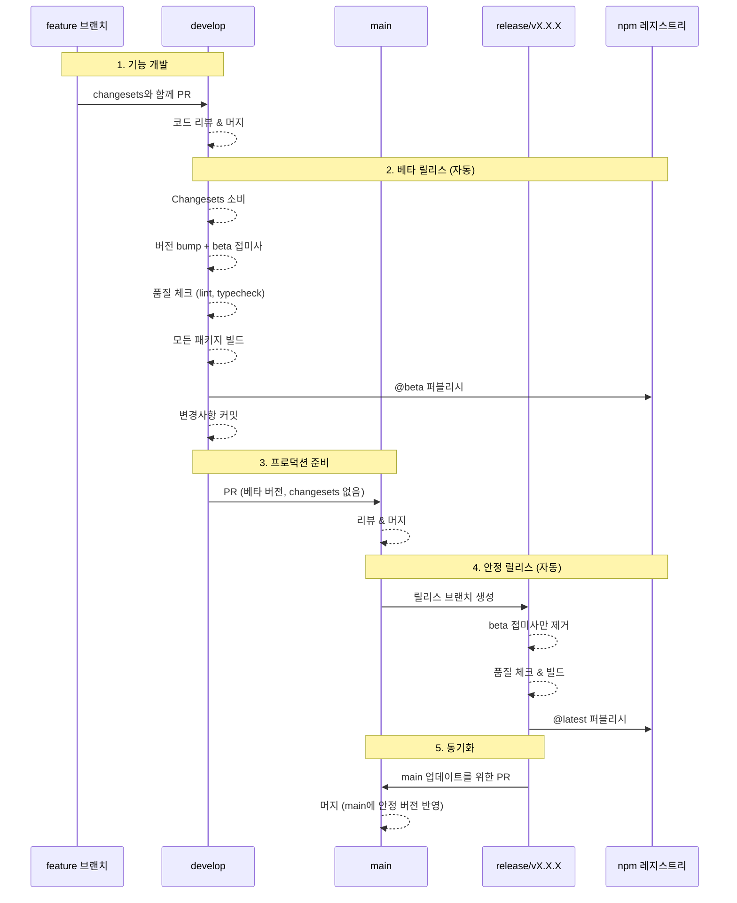
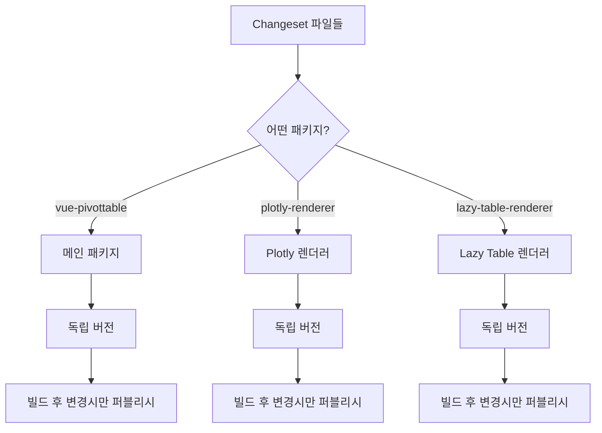

# 릴리스 전략

> [English](./RELEASE_STRATEGY.md) | 한국어

## 개요

이 문서는 Changesets를 사용하여 버전 관리를 하고 독립적인 패키지 릴리스를 지원하는 vue3-pivottable 모노레포의 릴리스 전략을 설명합니다.

## 릴리스 플로우



## 브랜치 책임

### develop 브랜치
- **목적**: 모든 기능의 통합 브랜치
- **자동 작업**:
  - changesets 소비 (파일 삭제됨)
  - changesets 기반 버전 bump
  - 타임스탬프와 함께 beta 접미사 추가
  - 품질 체크 실행 (ESLint, TypeScript)
  - 모든 패키지 빌드
  - @beta 태그로 npm에 퍼블리시
  - 버전 변경사항을 develop에 커밋

### main 브랜치
- **목적**: 프로덕션 준비 코드만
- **보호**: 직접 푸시 불가
- **자동 작업**:
  - release/vX.X.X 브랜치 생성
  - changeset 처리 없음 (develop에서 이미 완료)
  - 안정 릴리스 프로세스 트리거

### release/vX.X.X 브랜치
- **목적**: 안정 릴리스를 위한 임시 브랜치
- **자동 작업**:
  - 버전에서 beta 접미사 제거
  - 품질 체크 실행
  - 모든 패키지 빌드
  - @latest 태그로 npm에 퍼블리시
  - main으로 다시 PR 생성

## 패키지 독립성

모노레포는 독립적으로 버전이 관리되는 세 개의 패키지를 포함합니다:



### 설정
```json
{
  "linked": [],      // 연결된 패키지 없음
  "fixed": [],       // 고정 버전 없음
  "access": "public"
}
```

이를 통해 각 패키지는:
- 자체 버전 번호를 가짐
- 독립적으로 릴리스 가능
- 변경사항이 있을 때만 퍼블리시

## 버전 예시

### 시나리오 1: 단일 패키지 업데이트
```yaml
# 메인 패키지의 버그 수정을 위한 Changeset
"vue-pivottable": patch

# develop에서의 결과:
vue-pivottable: 1.1.1 → 1.1.2-beta.1234567890
@vue-pivottable/plotly-renderer: 2.0.0 (변경 없음)
@vue-pivottable/lazy-table-renderer: 1.0.13 (변경 없음)

# main/release에서의 결과:
vue-pivottable: 1.1.2-beta.1234567890 → 1.1.2
# 다른 패키지는 퍼블리시되지 않음
```

### 시나리오 2: 다중 패키지 업데이트
```yaml
# 새 기능을 위한 Changesets
"vue-pivottable": minor
"@vue-pivottable/plotly-renderer": minor

# develop에서의 결과:
vue-pivottable: 1.1.1 → 1.2.0-beta.1234567890
@vue-pivottable/plotly-renderer: 2.0.0 → 2.1.0-beta.1234567890
@vue-pivottable/lazy-table-renderer: 1.0.13 (변경 없음)

# main/release에서의 결과:
vue-pivottable: 1.2.0-beta.1234567890 → 1.2.0
@vue-pivottable/plotly-renderer: 2.1.0-beta.1234567890 → 2.1.0
# lazy-table-renderer는 퍼블리시되지 않음
```

## 품질 게이트

### PR 체크 (pr-check.yml)
1. ESLint - 모든 패키지
2. TypeScript 타입 체킹 - 모든 패키지
3. 빌드 검증 - 모든 패키지
4. Changeset 존재 확인

### 릴리스 체크
1. 빌드 전 타입 체킹
2. 빌드 전 린팅
3. 퍼블리시를 위해 빌드 성공 필수
4. 오류 허용 퍼블리싱 (한 패키지가 실패해도 다른 패키지 계속 진행)

## 워크플로우 파일

### 1. `.github/workflows/pr-check.yml`
- **트리거**: main 또는 develop으로의 PR
- **체크**: Lint, TypeCheck, Build, Changesets
- **목적**: 머지 전 코드 품질 보장

### 2. `.github/workflows/release-develop.yml`
- **트리거**: develop으로 푸시
- **작업**: 버전 관리, 빌드, @beta 퍼블리시
- **핵심 기능**: changesets 소비

### 3. `.github/workflows/release.yml`
- **트리거**: main으로 푸시
- **작업**: beta 접미사 제거, 빌드, @latest 퍼블리시
- **핵심 기능**: changeset 불필요

## 보안

### npm 토큰
- `NPM_TOKEN`: 메인 패키지 퍼블리싱
- `NPM_TOKEN_SUMIN`: 스코프 패키지 퍼블리싱
- GitHub Secrets로 저장

### 브랜치 보호
- main: PR 필수, 직접 푸시 불가
- develop: CI 커밋을 위해 열려있음
- release/*: 임시, 자동 생성

## 명령어 참조

| 명령어 | 설명 |
|---------|-------------|
| `pnpm changeset add` | 변경사항에 대한 changeset 추가 |
| `pnpm changeset status` | 대기 중인 changesets 확인 |
| `pnpm build:all` | 모든 패키지 빌드 |
| `pnpm typecheck` | TypeScript 체크 실행 |
| `pnpm lint` | ESLint 실행 |
| `pnpm -r <command>` | 모든 워크스페이스에서 명령 실행 |

## 모범 사례

1. **항상 changesets 추가** - 릴리스를 트리거해야 하는 변경사항에 대해
2. **베타에서 먼저 테스트** - main으로 승인하기 전에 npm @beta 확인
3. **독립 버전** - 변경되지 않은 패키지는 bump하지 않음
4. **품질 우선** - 퍼블리시 전 모든 체크 통과 필수

## 릴리스 프로세스 중 업데이트 처리

### 시나리오: main으로의 PR 이후 develop 변경사항

develop에서 main으로의 PR이 이미 열려있고 develop에 새로운 변경사항이 푸시되는 경우:

1. **자동 PR 업데이트**
   - release-develop 워크플로우가 기존 PR을 자동으로 감지
   - PR 제목을 새 베타 버전으로 업데이트
   - PR 설명에 타임스탬프와 새 버전 정보 업데이트
   - `auto-updated`와 `needs-review` 라벨 추가
   - PR을 "ready for review" 상태로 설정

2. **리뷰 프로세스**
   - 리뷰어는 라벨을 통해 업데이트 알림을 받음
   - 이전 승인은 유지되지만 재검토 권장
   - PR 설명에 명확한 "Updated" 상태와 타임스탬프 표시

3. **장점**
   - PR 히스토리와 토론 내용 보존
   - 수동 개입 불필요
   - 모든 베타 버전의 명확한 감사 추적

### 예시 플로우
```
1. v1.2.0-beta.1234567890 → PR #123 생성
2. develop에 새로운 수정사항 푸시
3. v1.2.1-beta.2345678901 → PR #123 자동 업데이트
4. 리뷰어가 "auto-updated" 라벨 확인 후 재검토
5. 승인 후 main으로 머지하면 안정 릴리스 트리거
```

## 문제 해결

### 베타 버전이 퍼블리시되지 않나요?
- changesets가 존재하는지 확인
- 빌드가 성공하는지 검증
- npm 토큰 권한 확인

### 패키지가 업데이트되지 않나요?
- changeset에 패키지 이름이 포함되어 있는지 확인
- 패키지에 빌드 스크립트가 있는지 확인
- package.json의 이름이 일치하는지 검증

### CI에서는 타입 오류가 있는데 로컬에서는 없나요?
- 로컬에서 `pnpm typecheck` 실행
- 모든 워크스페이스 패키지 확인: `pnpm -r typecheck`
- 의존성이 최신인지 확인

### PR이 자동으로 업데이트되지 않나요?
- GitHub Actions 권한 확인
- GITHUB_TOKEN이 PR 쓰기 권한을 가지고 있는지 검증
- PR이 열린 상태인지 확인