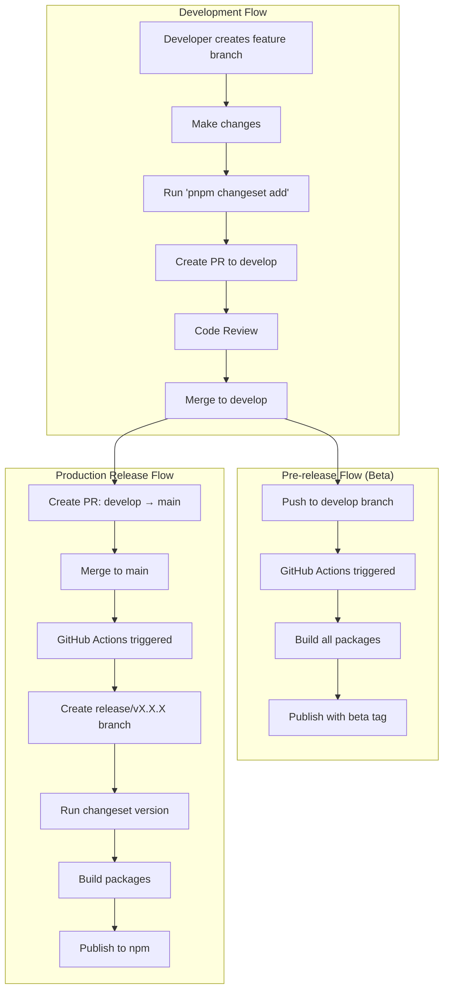
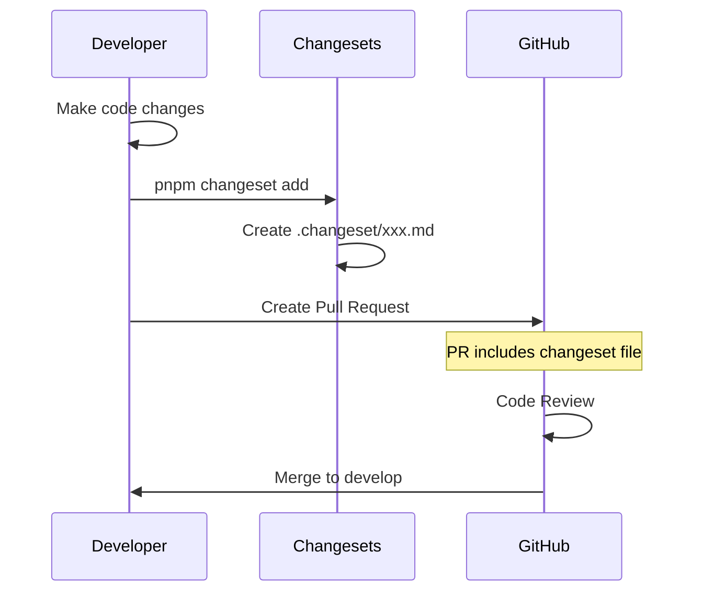
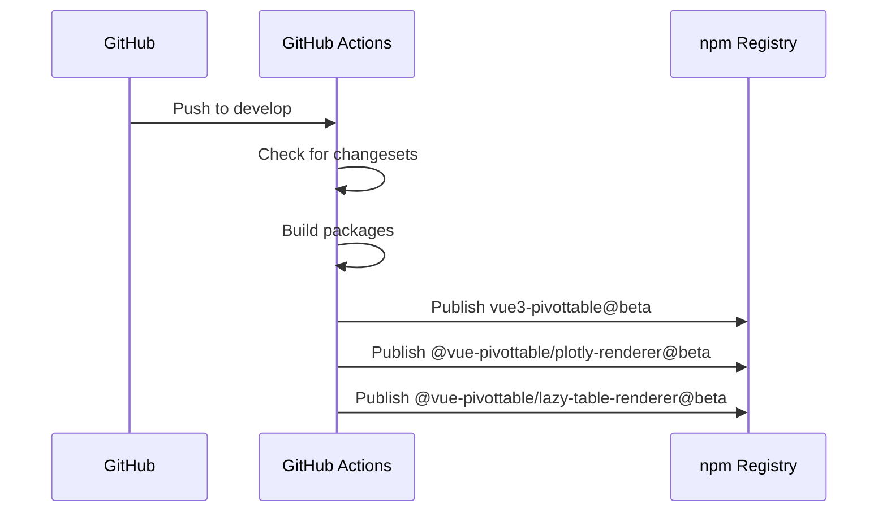
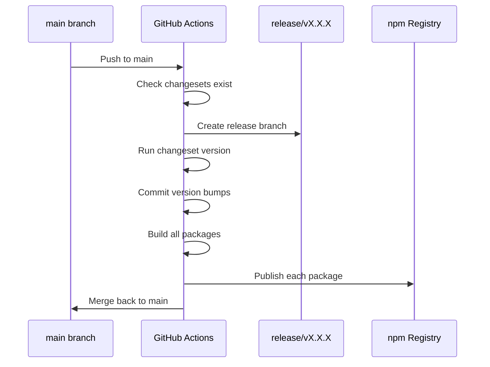
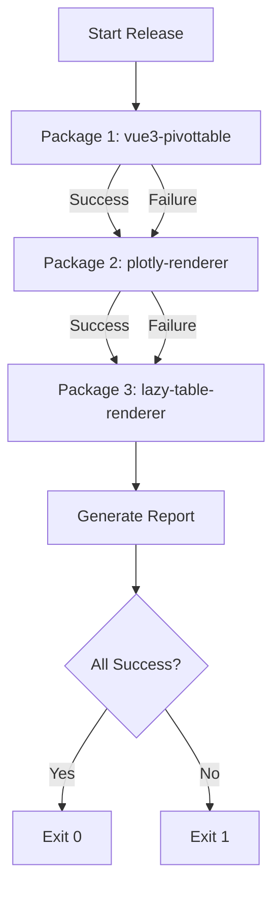
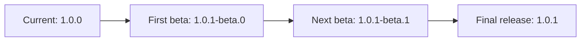

# Release Strategy

## Overview

This document outlines the release strategy for the vue3-pivottable monorepo, which uses Changesets for version management and supports independent package releases.

## Architecture



## Package Structure

Our monorepo contains three independently versioned packages:

```mermaid
graph TD
    A[vue3-pivottable monorepo] --> B[vue3-pivottable<br/>Main package]
    A --> C[@vue-pivottable/plotly-renderer<br/>Plotly visualization]
    A --> D[@vue-pivottable/lazy-table-renderer<br/>Virtual scrolling table]
    
    B --> E[NPM_TOKEN]
    C --> F[NPM_TOKEN_SUMIN]
    D --> F
```

## Release Process

### 1. Development Phase



### 2. Beta Release (Automated)



### 3. Production Release (Automated)



## Independent Package Releases

Each package can be released independently based on its changesets:

```mermaid
graph LR
    subgraph "Changeset Detection"
        A[.changeset/xxx.md] --> B{Which package?}
        B -->|vue3-pivottable| C[Version main package]
        B -->|@vue-pivottable/plotly-renderer| D[Version plotly-renderer]
        B -->|@vue-pivottable/lazy-table-renderer| E[Version lazy-table-renderer]
    end
    
    subgraph "Release Execution"
        C --> F[Build & Publish main]
        D --> G[Build & Publish plotly]
        E --> H[Build & Publish lazy-table]
    end
```

## Version Management

### Changeset Configuration

```json
{
  "linked": [],      // No linked packages
  "fixed": [],       // No fixed versioning
  "access": "public",
  "baseBranch": "main"
}
```

This configuration ensures:
- Each package maintains its own version
- Packages can be released independently
- No forced version synchronization

### Version Bump Rules

| Change Type | Version Bump | Example |
|------------|--------------|---------|
| patch | 1.0.0 → 1.0.1 | Bug fixes |
| minor | 1.0.0 → 1.1.0 | New features |
| major | 1.0.0 → 2.0.0 | Breaking changes |

## Fault Tolerance

The release script (`scripts/release-packages.js`) implements fault tolerance:



## Pre-release Workflow

Beta releases follow this naming convention:



## GitHub Actions Workflows

### Release Workflow (`.github/workflows/release.yml`)
- Triggered on: Push to `main`
- Creates release branches
- Publishes to npm with latest tag

### Pre-release Workflow (`.github/workflows/release-develop.yml`)
- Triggered on: Push to `develop`
- Publishes to npm with beta tag
- No version commits to develop

## Security Considerations

### npm Tokens
- `NPM_TOKEN`: Used for main package
- `NPM_TOKEN_SUMIN`: Used for scoped packages
- Tokens stored as GitHub Secrets

### Branch Protection
- `main` branch: Protected with "Restrict pushes that create matching branches"
- `release/*` branches: Exempt from restrictions
- No GitHub App token required

## Rollback Strategy

In case of issues:

1. **Revert on npm**: Use `npm unpublish` within 72 hours
2. **Git revert**: Create revert PR to main
3. **Hotfix**: Create changeset with patch bump

## Best Practices

1. **Always create changesets** for changes that affect published packages
2. **Use conventional commit messages** for clarity
3. **Test thoroughly** before merging to main
4. **Monitor** npm publish results in GitHub Actions

## Commands Reference

| Command | Description |
|---------|-------------|
| `pnpm changeset add` | Create a new changeset |
| `pnpm changeset version` | Update versions based on changesets |
| `pnpm changeset publish` | Publish packages to npm |
| `pnpm build:all` | Build all packages |
| `pnpm release:packages` | Run custom release script |

## Troubleshooting

### Common Issues

1. **Build failures**: Check package dependencies
2. **Publish failures**: Verify npm tokens
3. **Version conflicts**: Ensure changesets are properly configured

### Debug Commands

```bash
# Check pending changesets
ls .changeset/*.md | grep -v README.md

# Verify package versions
pnpm list --depth=0

# Test build locally
pnpm build:all
```

## References

- [Changesets Documentation](https://github.com/changesets/changesets)
- [npm Publishing Guide](https://docs.npmjs.com/cli/v8/commands/npm-publish)
- [GitHub Actions Documentation](https://docs.github.com/en/actions)