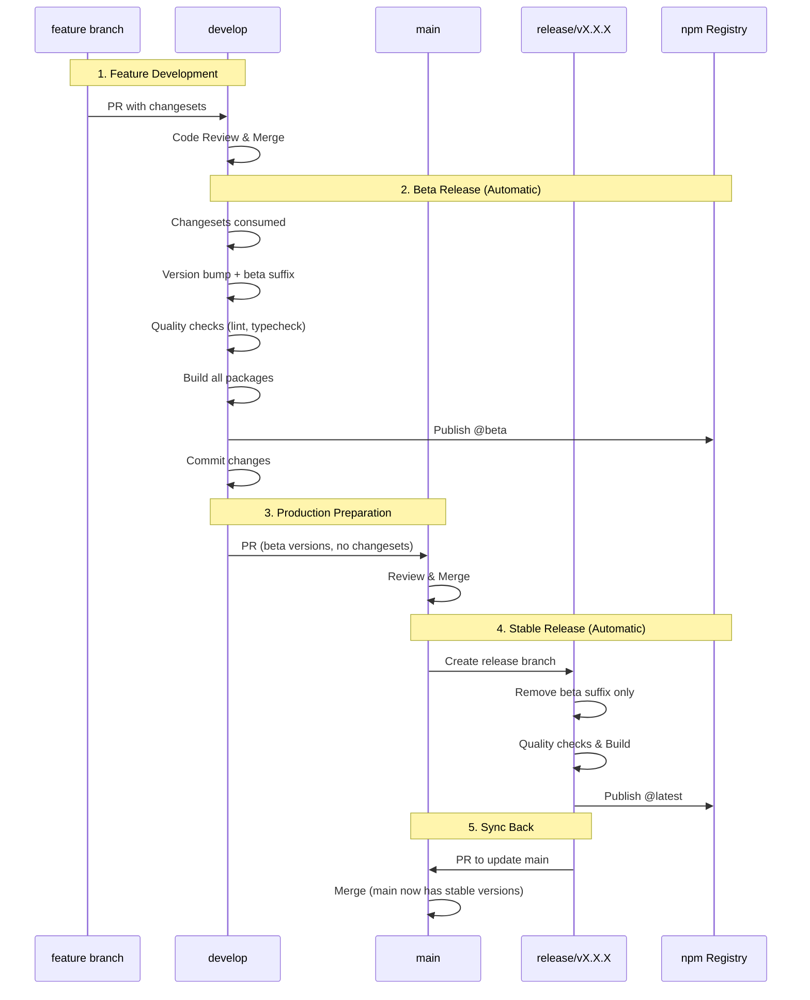
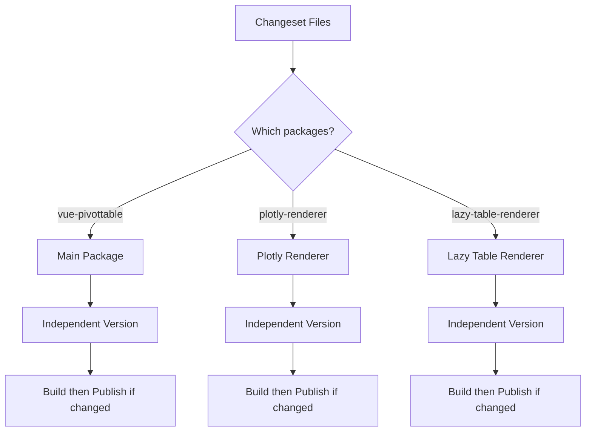

# Release Strategy

> English | [한국어](./RELEASE_STRATEGY.ko.md)

## Overview

This document outlines the release strategy for the vue3-pivottable monorepo, which uses Changesets for version management and supports independent package releases.

## Release Flow



## Branch Responsibilities

### develop Branch
- **Purpose**: Integration branch for all features
- **Automatic Actions**:
  - Consume changesets (files are deleted)
  - Bump versions based on changesets
  - Add beta suffix with timestamp
  - Run quality checks (ESLint, TypeScript)
  - Build all packages
  - Publish to npm with @beta tag
  - Commit version changes back to develop

### main Branch
- **Purpose**: Production-ready code only
- **Protection**: Cannot push directly
- **Automatic Actions**:
  - Create release/vX.X.X branch
  - No changeset processing (already done in develop)
  - Trigger stable release process

### release/vX.X.X Branch
- **Purpose**: Temporary branch for stable releases
- **Automatic Actions**:
  - Remove beta suffix from versions
  - Run quality checks
  - Build all packages
  - Publish to npm with @latest tag
  - Create PR back to main

## Package Independence

Our monorepo contains three independently versioned packages:



### Configuration
```json
{
  "linked": [],      // No linked packages
  "fixed": [],       // No fixed versioning
  "access": "public"
}
```

This ensures each package:
- Has its own version number
- Can be released independently
- Only publishes when it has changes

## Version Examples

### Scenario 1: Single Package Update
```yaml
# Changeset for bug fix in main package
"vue-pivottable": patch

# Result in develop:
vue-pivottable: 1.1.1 → 1.1.2-beta.1234567890
@vue-pivottable/plotly-renderer: 2.0.0 (unchanged)
@vue-pivottable/lazy-table-renderer: 1.0.13 (unchanged)

# Result in main/release:
vue-pivottable: 1.1.2-beta.1234567890 → 1.1.2
# Other packages not published
```

### Scenario 2: Multiple Package Updates
```yaml
# Changesets for new features
"vue-pivottable": minor
"@vue-pivottable/plotly-renderer": minor

# Result in develop:
vue-pivottable: 1.1.1 → 1.2.0-beta.1234567890
@vue-pivottable/plotly-renderer: 2.0.0 → 2.1.0-beta.1234567890
@vue-pivottable/lazy-table-renderer: 1.0.13 (unchanged)

# Result in main/release:
vue-pivottable: 1.2.0-beta.1234567890 → 1.2.0
@vue-pivottable/plotly-renderer: 2.1.0-beta.1234567890 → 2.1.0
# lazy-table-renderer not published
```

## Quality Gates

### PR Checks (pr-check.yml)
1. ESLint - all packages
2. TypeScript type checking - all packages
3. Build verification - all packages
4. Changeset presence check

### Release Checks
1. Type checking before build
2. Linting before build
3. Build must succeed for publish
4. Fault-tolerant publishing (continue with other packages if one fails)

## Workflow Files

### 1. `.github/workflows/pr-check.yml`
- **Triggers**: PR to main or develop
- **Checks**: Lint, TypeCheck, Build, Changesets
- **Purpose**: Ensure code quality before merge

### 2. `.github/workflows/release-develop.yml`
- **Triggers**: Push to develop
- **Actions**: Version, Build, Publish @beta
- **Key Feature**: Consumes changesets

### 3. `.github/workflows/release.yml`
- **Triggers**: Push to main
- **Actions**: Remove beta suffix, Build, Publish @latest
- **Key Feature**: No changeset needed

## Security

### npm Tokens
- `NPM_TOKEN`: Main package publishing
- `NPM_TOKEN_SUMIN`: Scoped packages publishing
- Stored as GitHub Secrets

### Branch Protection
- main: Requires PR, no direct push
- develop: Open for CI commits
- release/*: Temporary, auto-created

## Commands Reference

| Command | Description |
|---------|-------------|
| `pnpm changeset add` | Add a changeset for your changes |
| `pnpm changeset status` | Check pending changesets |
| `pnpm build:all` | Build all packages |
| `pnpm typecheck` | Run TypeScript checks |
| `pnpm lint` | Run ESLint |
| `pnpm -r <command>` | Run command in all workspaces |

## Best Practices

1. **Always add changesets** for changes that should trigger releases
2. **Test in beta first** - Check npm @beta before approving to main
3. **Independent versions** - Don't bump unchanged packages
4. **Quality first** - All checks must pass before publish

## Handling Updates During Release Process

### Scenario: Changes to develop after PR to main

When a PR from develop to main is already open and new changes are pushed to develop:

1. **Automatic PR Update**
   - The release-develop workflow automatically detects existing PR
   - Updates PR title with new beta version
   - Updates PR description with timestamp and new version info
   - Adds `auto-updated` and `needs-review` labels
   - Sets PR back to "ready for review" state

2. **Review Process**
   - Reviewers are notified of the update via labels
   - Previous approvals remain but re-review is recommended
   - PR description shows clear "Updated" status with timestamp

3. **Benefits**
   - PR history and discussions are preserved
   - No manual intervention required
   - Clear audit trail of all beta versions

### Example Flow
```
1. v1.2.0-beta.1234567890 → PR #123 created
2. New fix pushed to develop
3. v1.2.1-beta.2345678901 → PR #123 automatically updated
4. Reviewers see "auto-updated" label and re-review
5. Once approved, merge to main triggers stable release
```

## Troubleshooting

### Beta version not publishing?
- Check if changesets exist
- Verify build succeeds
- Check npm token permissions

### Package not updating?
- Ensure changeset includes the package name
- Check if package has build script
- Verify package.json name matches

### Type errors in CI but not locally?
- Run `pnpm typecheck` locally
- Check all workspace packages: `pnpm -r typecheck`
- Ensure dependencies are up to date

### PR not updating automatically?
- Check GitHub Actions permissions
- Verify GITHUB_TOKEN has write access to PRs
- Check if PR is in open state