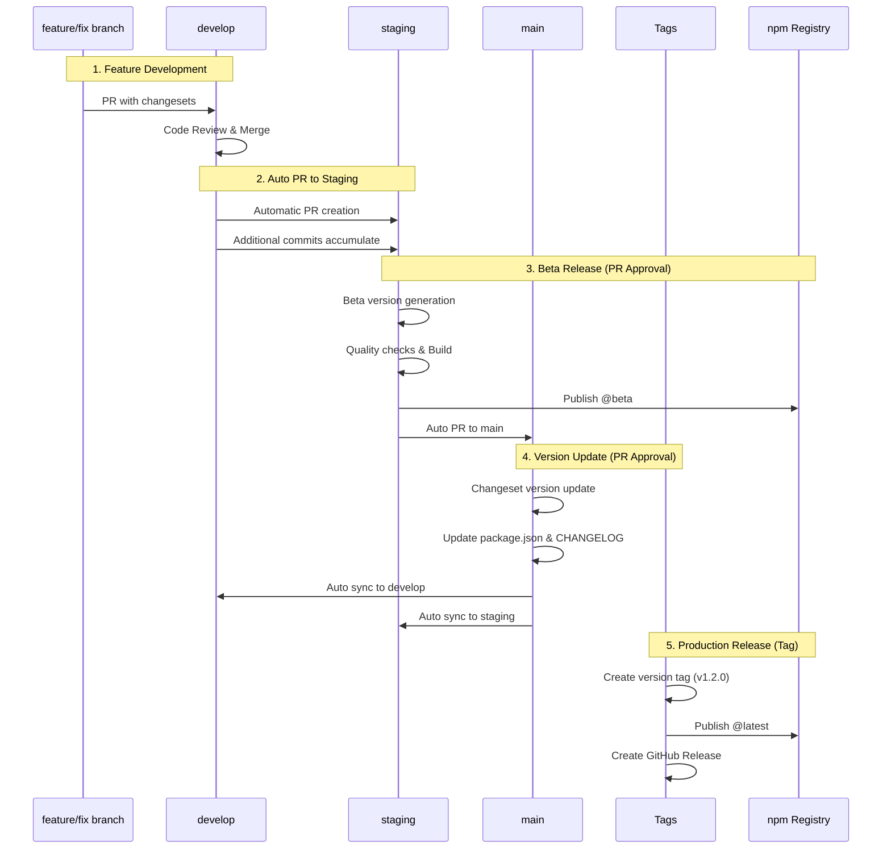

# Release Strategy

> English | [한국어](./RELEASE_STRATEGY.ko.md)

## Overview

This document outlines the release strategy for the vue3-pivottable monorepo, which uses automated workflows, Changesets for version management, and tag-based releases for production deployment.

## Release Flow



## Branch Responsibilities

### develop Branch
- **Purpose**: Integration branch for all features
- **Automatic Actions**:
  - Trigger auto PR to staging on push
  - Accumulate changes in existing staging PR
  - Continuous integration checks

### staging Branch
- **Purpose**: QA testing and beta releases
- **Automatic Actions on PR merge**:
  - Check for accumulated changesets
  - If changesets exist:
    - Consume changesets (delete files)
    - Generate beta version (x.y.z-beta.timestamp)
    - Run quality checks (ESLint, TypeScript)
    - Build all packages
    - Publish to npm with @beta tag
    - Create auto PR to main
  - If no changesets: skip release process

### main Branch
- **Purpose**: Production-ready code
- **Protection**: No direct commits (only PRs)
- **Automatic Actions on PR merge**:
  - Execute `changeset version`
  - Update package.json versions
  - Generate/update CHANGELOG.md
  - Commit version changes
  - Sync changes to develop and staging
  - **No npm publish**

### Tags (v*.*.*)
- **Purpose**: Trigger production releases
- **Created**: Manually after main update
- **Automatic Actions**:
  - Checkout tagged commit
  - Build all packages
  - Publish to npm with @latest tag
  - Create GitHub Release

## Package Independence

Our monorepo contains three independently versioned packages:


### Configuration
```json
{
  "linked": [],      // No linked packages
  "fixed": [],       // No fixed versioning
  "access": "public"
}
```

This ensures each package:
- Has its own version number
- Can be released independently
- Only publishes when it has changes

## Version Examples

### Scenario 1: Single Package Update
```yaml
# Changeset for bug fix in main package
"vue-pivottable": patch

# Result in staging:
vue-pivottable: 1.1.1 → 1.1.2-beta.1234567890
@vue-pivottable/plotly-renderer: 2.0.0 (unchanged)
@vue-pivottable/lazy-table-renderer: 1.0.13 (unchanged)

# Result after main merge:
vue-pivottable: 1.1.2 (version updated, not published)

# Result after tag v1.1.2:
vue-pivottable: 1.1.2 → npm @latest
```

### Scenario 2: Multiple Package Updates
```yaml
# Changesets for new features
"vue-pivottable": minor
"@vue-pivottable/plotly-renderer": minor

# Result in staging:
vue-pivottable: 1.1.1 → 1.2.0-beta.1234567890
@vue-pivottable/plotly-renderer: 2.0.0 → 2.1.0-beta.1234567890

# Result after main merge:
vue-pivottable: 1.2.0 (updated)
@vue-pivottable/plotly-renderer: 2.1.0 (updated)

# Result after tag v1.2.0:
Both packages → npm @latest
```

## Quality Gates

### PR Checks (pr-check.yml)
1. ESLint - all packages
2. TypeScript type checking - all packages
3. Build verification - all packages
4. Changeset presence check

### Release Checks
1. Type checking before build
2. Linting before build
3. Build must succeed for publish
4. Fault-tolerant publishing (continue with other packages if one fails)

## Workflow Files

### 1. `.github/workflows/pr-check.yml`
- **Triggers**: PR to any branch
- **Checks**: Lint, TypeCheck, Build, Changesets
- **Purpose**: Ensure code quality before merge

### 2. `.github/workflows/integrate-develop.yml`
- **Triggers**: Push to develop
- **Actions**: Create/update PR to staging
- **Key Feature**: Accumulates multiple changes

### 3. `.github/workflows/release-staging.yml`
- **Triggers**: Push to staging
- **Condition**: When changesets exist (accumulated from develop)
- **Actions**: Beta version, Build, Publish @beta
- **Key Feature**: Consumes changesets, Auto PR to main

### 4. `.github/workflows/update-version.yml`
- **Triggers**: Push to main (with beta versions)
- **Actions**: Update versions, sync branches
- **Key Feature**: No npm publish

### 5. `.github/workflows/release-tag.yml`
- **Triggers**: Tag push (v*.*.*)
- **Actions**: Build, Publish @latest
- **Key Feature**: Production deployment

## Security

### npm Tokens
- `NPM_TOKEN`: Main package publishing
- `NPM_TOKEN_SUMIN`: Scoped packages publishing
- Stored as GitHub Secrets

### Branch Protection
- main: Requires PR, no direct push
- staging: Requires PR, no direct push
- develop: Requires PR, no direct push

## Commands Reference

| Command | Description |
|---------|-------------|
| `pnpm changeset` | Add a changeset for your changes |
| `pnpm changeset status` | Check pending changesets |
| `pnpm changeset version` | Apply changesets to versions |
| `pnpm build:all` | Build all packages |
| `pnpm typecheck` | Run TypeScript checks |
| `pnpm lint` | Run ESLint |
| `pnpm -r <command>` | Run command in all workspaces |

## Best Practices

1. **Always add changesets** for changes that should trigger releases
2. **Test in beta first** - staging provides beta testing environment
3. **Review auto PRs** - Check automated PRs before approving
4. **Tag after main update** - Create tags only after version update in main

## Handling Updates During Release Process

### Scenario: Continuous Development Flow

The workflow handles ongoing development seamlessly:

1. **Automatic PR Updates**
   - develop → staging PR accumulates new commits
   - PR description updates with each addition
   - Single PR for multiple features/fixes

2. **Beta Version Management**
   - Each staging merge creates new beta version
   - Previous beta versions remain available
   - Clear version progression tracking

3. **Synchronization**
   - main updates flow back to develop/staging
   - Prevents divergence between branches
   - Maintains linear history

### Example Flow
```
1. Feature A merged to develop → Auto PR #123 to staging
2. Feature B merged to develop → PR #123 updated
3. PR #123 approved → v1.2.0-beta.1234567890
4. Auto PR #124 to main created
5. PR #124 approved → Version 1.2.0 in main
6. Tag v1.2.0 created → Published to npm
7. develop/staging synced with main
```

## Release Checklist

### For Developers
- [ ] Create feature/fix branch from develop
- [ ] Add changeset with appropriate version bump
- [ ] Create PR to develop
- [ ] Ensure all checks pass

### For QA Team
- [ ] Review staging PR contents
- [ ] Test beta version from npm
- [ ] Approve staging PR when ready

### For Release Manager
- [ ] Review main PR from staging
- [ ] Approve main PR (triggers version update)
- [ ] Wait for sync completion
- [ ] Create and push version tag:
  ```bash
  git checkout main
  git pull origin main
  git tag v1.2.0
  git push origin v1.2.0
  ```
- [ ] Verify npm deployment
- [ ] Check GitHub Release creation

## Troubleshooting

### Auto PR not created?
- Check GitHub Actions runs
- Verify branch protections allow bot PRs
- Check for existing open PRs

### Beta version not publishing?
- Verify changesets were added
- Check build success in staging
- Verify npm token validity

### Sync failed?
- Check for merge conflicts
- Review workflow logs
- Manual sync may be needed

### Tag release failed?
- Ensure tag matches version pattern (v*.*.*)
- Check npm token permissions
- Verify package builds succeed