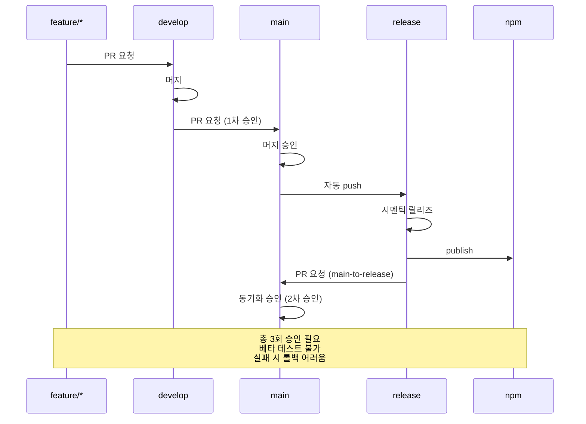
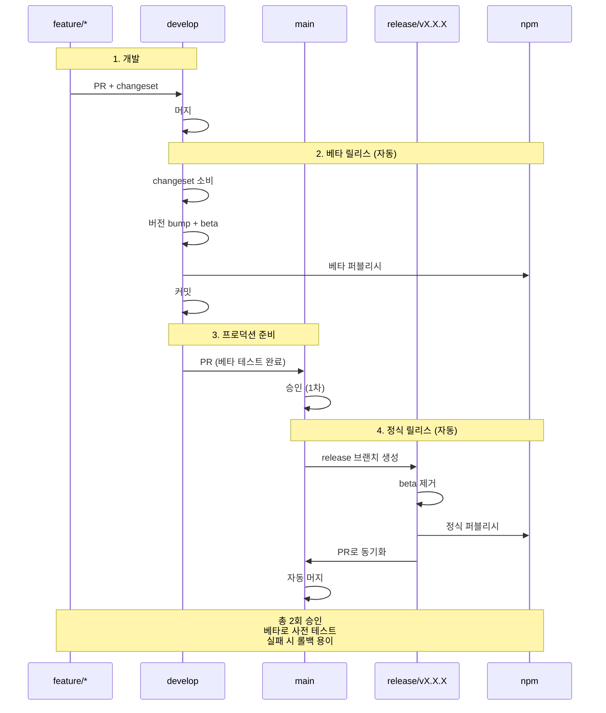

# To. 수민님

베타 릴리스 워크플로우 도입 배경과 개선사항을 공유드립니다.

## 📋 핵심 요구사항
- main 브랜치 보호 (직접 push 불가, 1명 이상 승인 필수)
- 자동 버전 관리 및 체인지로그 업데이트
- 모노레포 내 독립적 패키지 버전 관리
- 보호 규칙 우회 없이 release 브랜치에서 배포 후 main 동기화

## 🔄 기존 워크플로우

## ❌ 실제 발생한 문제

### TypeScript 전환 시 대참사
1. **빌드 실패 무시** → 하위 패키지 빌드 실패했지만 "메인은 괜찮겠지"하고 진행
2. **리버트 시도** → 시멘틱 릴리즈가 오작동하여 lazy-table-renderer 버전 의도치 않게 업데이트
3. **보호 규칙 해제** → main에 강제 push했지만 JS/TS 버전 충돌
4. **완전히 꼬임** → release와 main-to-release 브랜치 간 충돌로 JS 버전이 다시 릴리즈

## ✨ 새로운 워크플로우

## 🚀 주요 개선점

### 1. **Changesets 도입**
- 각 PR에 변경사항 명시
- 모노레포 패키지별 독립 버전 관리
- 시멘틱 릴리즈의 오작동 방지

### 2. **베타 릴리스**
- develop에서 자동으로 베타 버전 생성
- 실제 npm에 퍼블리시하여 테스트 가능
- 문제 발견 시 main 머지 전 수정 가능

### 3. **프로세스 단순화**
- 승인 횟수: 3회 → 2회
- 각 단계별 자동화
- 명확한 롤백 전략

### 4. **안정성 향상**
- 빌드 실패 시 즉시 중단 (`set -e`)
- GitHub Release 생성 후 npm 퍼블리시
- 타입 선언 파일 문제 해결 (빌드 순서 조정)

## 📊 결과
- ✅ 베타 릴리스 성공
- ✅ 빌드 오류 감지 및 차단
- ✅ 안정적인 배포 프로세스 구축

이제 TypeScript 버전도 안전하게 배포할 수 있습니다! 🎉