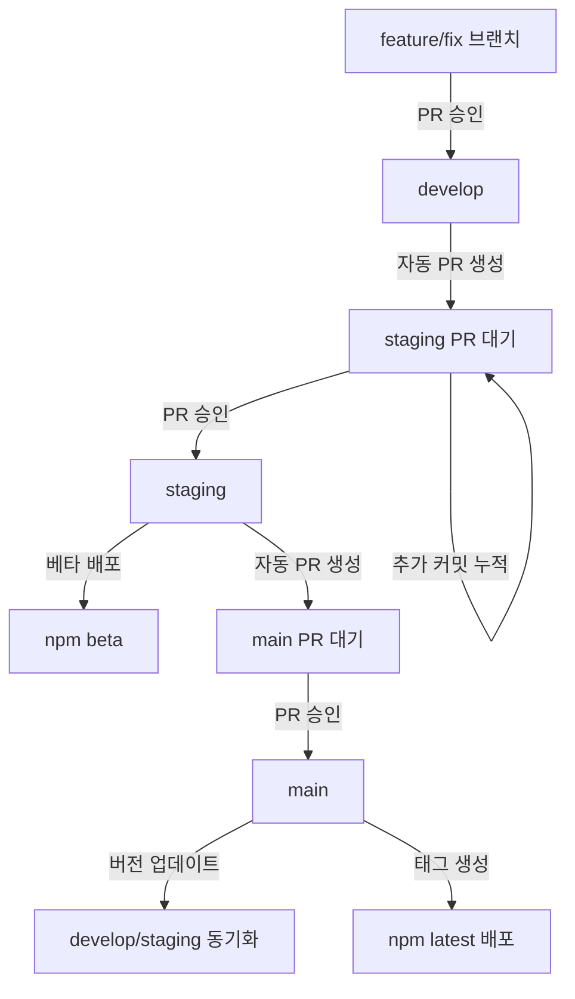

# Git Flow 전략 문서

## 목차
1. [개요](#개요)
2. [브랜치 전략](#브랜치-전략)
3. [자동화된 워크플로우](#자동화된-워크플로우)
4. [버전 관리 전략](#버전-관리-전략)
5. [CI/CD 파이프라인](#cicd-파이프라인)
6. [팀 가이드라인](#팀-가이드라인)
7. [실전 가이드](#실전-가이드)

## 개요

이 문서는 vue3-pivottable 프로젝트의 Git Flow 전략을 정의합니다. 브랜치 보호 규칙과 자동화를 효과적으로 조합하여, 안정적이면서도 효율적인 개발 프로세스를 구축합니다.

### 핵심 원칙
- **자동화된 PR 생성**: 브랜치 간 자동 PR로 수동 작업 최소화
- **명확한 환경 분리**: develop(개발) → staging(QA) → main(프로덕션)
- **태그 기반 릴리즈**: 브랜치 보호와 자동화를 양립
- **지속적 동기화**: 모든 브랜치를 최신 상태로 유지

## 브랜치 전략

### 브랜치 구조

```
main (production) - 태그 기반 정식 릴리즈
  ├── hotfix/* - 긴급 수정
  └── staging (QA) - 베타 배포
       └── develop (integration) - 개발 통합
            ├── feature/* - 새 기능
            └── fix/* - 버그 수정
```

### 브랜치별 역할

#### develop (개발 통합)
- **목적**: 모든 개발 작업의 통합점
- **자동화**: PR 승인 시 staging으로 자동 PR 생성
- **특징**: 지속적 통합(CI) 실행

#### staging (QA/베타)
- **목적**: QA 테스트 및 베타 배포
- **배포**: npm beta 태그
- **버전**: x.y.z-beta.timestamp
- **자동화**: 
  - develop에서 자동 PR 수신 (changesets 누적)
  - PR 승인 시 changesets 확인
  - changesets 있을 때만 베타 배포
  - 배포 후 main으로 자동 PR 생성

#### main (프로덕션)
- **목적**: 프로덕션 코드 관리
- **배포**: 태그 생성 시 npm latest
- **자동화**:
  - staging에서 자동 PR 수신
  - 승인 시 버전 업데이트 (배포는 안 함)
  - develop/staging 자동 동기화

#### feature/* & fix/*
- **생성**: develop에서 분기
- **머지**: develop으로 PR
- **네이밍**: 
  - feature/기능명
  - fix/이슈번호-설명

#### hotfix/*
- **생성**: main에서 분기
- **머지**: main으로 직접 PR
- **용도**: 프로덕션 긴급 수정

## 자동화된 워크플로우

### 전체 플로우 다이어그램



### 상세 프로세스

#### 1. 개발 → 스테이징 (자동)

**트리거**: develop PR 승인
**동작**:
1. develop → staging 자동 PR 생성
2. 기존 PR이 있으면 커밋 추가
3. PR 설명에 포함된 기능 목록 자동 업데이트

**특징**:
- 여러 개발 사항이 하나의 PR에 누적
- QA 팀이 일괄 테스트 가능

#### 2. 스테이징 승인 → 베타 배포

**트리거**: staging PR 승인
**동작**:
1. 누적된 changesets 확인
2. changesets가 있을 경우:
   - changesets 소비 (파일 삭제)
   - 베타 버전 자동 생성 (x.y.z-beta.timestamp)
   - npm beta 태그로 배포
   - GitHub pre-release 생성
   - main으로 자동 PR 생성
3. changesets가 없으면 릴리즈 건너뛰기

#### 3. 메인 승인 → 버전 업데이트

**트리거**: main PR 승인
**동작**:
1. Changeset version 실행
2. package.json 버전 업데이트
3. CHANGELOG.md 생성
4. 변경사항 main에 커밋
5. develop과 staging 자동 동기화
6. **npm 배포는 하지 않음**

#### 4. 태그 생성 → 정식 배포

**트리거**: v*.*.* 태그 푸시
**동작**:
1. 태그된 커밋에서 체크아웃
2. npm latest 태그로 배포
3. GitHub Release 생성
4. 릴리즈 노트 자동 생성

### 동기화 전략

main이 업데이트되면 다음 순서로 동기화:
1. main → develop (자동 머지)
2. main → staging (자동 머지)

**동기화 시 주의사항**:
- 충돌 가능성은 낮음 (순차적 머지이므로)
- 베타 버전이 있는 staging은 재배포하지 않음
- 동기화 실패 시 알림 발송

## 버전 관리 전략

### 버전 형식
- **개발**: 수동 버전 관리 없음
- **스테이징**: `1.2.0-beta.1234567890`
- **메인**: `1.2.0` (태그 생성 전까지 배포 안 함)
- **태그**: `v1.2.0` (정식 릴리즈)

### Changesets 활용
- 모든 PR에 changeset 필수
- staging → main PR 승인 시 자동 적용
- 버전 업데이트와 CHANGELOG 자동 생성

### npm 태그 전략
- `beta`: staging 브랜치 자동 배포
- `latest`: 태그 생성 시에만 배포

## CI/CD 파이프라인

### 1. PR 체크 (pr-check.yml)
**트리거**: 모든 PR
**검증 항목**:
- Lint & TypeScript 체크
- 빌드 테스트
- Changeset 존재 여부
- 테스트 실행

### 2. 개발 통합 (integrate-develop.yml)
**트리거**: develop push
**작업**:
- staging으로 자동 PR 생성/업데이트
- PR 라벨 자동 추가

### 3. 베타 릴리즈 (release-staging.yml)
**트리거**: staging push
**조건**: changesets 존재 시 (develop에서 누적됨)
**작업**:
1. changesets 소비 (파일 삭제)
2. 베타 버전 생성
3. npm beta 배포
4. main으로 자동 PR 생성

### 4. 버전 업데이트 (update-version.yml)
**트리거**: main push
**조건**: 베타 버전 존재 시
**작업**:
1. Changeset version 실행
2. 버전 커밋
3. develop/staging 동기화

### 5. 정식 릴리즈 (release-tag.yml)
**트리거**: 태그 푸시 (v*.*.*)
**작업**:
1. npm latest 배포
2. GitHub Release 생성

## 팀 가이드라인

### 브랜치 작업 규칙

#### 일반 개발
1. develop에서 feature/fix 브랜치 생성
2. 작업 완료 후 develop으로 PR
3. Changeset 추가 필수
4. 코드 리뷰 후 승인

#### 긴급 수정
1. main에서 hotfix 브랜치 생성
2. 수정 후 main으로 직접 PR
3. 승인 후 자동 동기화 확인

### 릴리즈 담당자 가이드

#### 정식 릴리즈 절차
1. main PR 승인 (버전 업데이트됨)
2. 동기화 완료 확인
3. 태그 생성 및 푸시:
   ```bash
   git checkout main
   git pull origin main
   git tag v1.2.0
   git push origin v1.2.0
   ```
4. 배포 모니터링

### Changeset 작성 가이드

**언제 필요한가?**
- 모든 기능 추가/수정/버그 픽스
- 사용자에게 영향을 주는 모든 변경

**버전 선택 기준**:
- **Major**: Breaking changes
- **Minor**: 새 기능 (하위 호환)
- **Patch**: 버그 수정

## 실전 가이드

### 시나리오 1: 새 기능 개발

1. **브랜치 생성**
   - develop → feature/new-feature

2. **개발 및 PR**
   - Changeset 추가
   - develop으로 PR 생성

3. **자동 프로세스**
   - PR 승인 → staging 자동 PR
   - staging 승인 → 베타 배포
   - main 자동 PR 대기

### 시나리오 2: 베타 테스트 중 버그 발견

1. **수정 작업**
   - develop → fix/bug-in-beta
   - 버그 수정 후 PR

2. **자동 업데이트**
   - 기존 staging PR에 커밋 추가
   - QA 재테스트

### 시나리오 3: 프로덕션 긴급 패치

1. **Hotfix 생성**
   - main → hotfix/critical-bug

2. **빠른 배포**
   - main PR 승인
   - 즉시 태그 생성하여 배포

### 자주 사용하는 명령어

**개발**:
```bash
# feature 브랜치 생성
git checkout develop
git pull origin develop
git checkout -b feature/my-feature

# changeset 추가
pnpm changeset
```

**릴리즈**:
```bash
# 태그 생성 (릴리즈 담당자)
git checkout main
git pull origin main
git tag v1.2.0
git push origin v1.2.0
```

### 트러블슈팅

**문제: 자동 PR에 충돌 발생**
- develop을 최신으로 업데이트 후 재시도
- 수동으로 충돌 해결 후 푸시

**문제: 동기화 실패**
- 워크플로우 로그 확인
- 수동 동기화 필요시 관리자 문의

**문제: 베타 버전이 main에 반영 안 됨**
- staging에 베타 태그 확인
- main PR이 자동 생성되었는지 확인

## 프로젝트 자동화 도구

### Changesets
- 버전 관리 자동화
- CHANGELOG 자동 생성
- 모노레포 지원

### pnpm Workspace
```
vue3-pivottable/
├── packages/
│   ├── plotly-renderer/
│   └── lazy-table-renderer/
└── pnpm-workspace.yaml
```

### 릴리즈 스크립트
- `scripts/release-packages.cjs`
- 환경변수:
  - NPM_TOKEN
  - NPM_TOKEN_SUMIN
  - RELEASE_TAG

---

*이 문서는 지속적으로 업데이트됩니다. 변경사항은 PR을 통해 제안해주세요.*