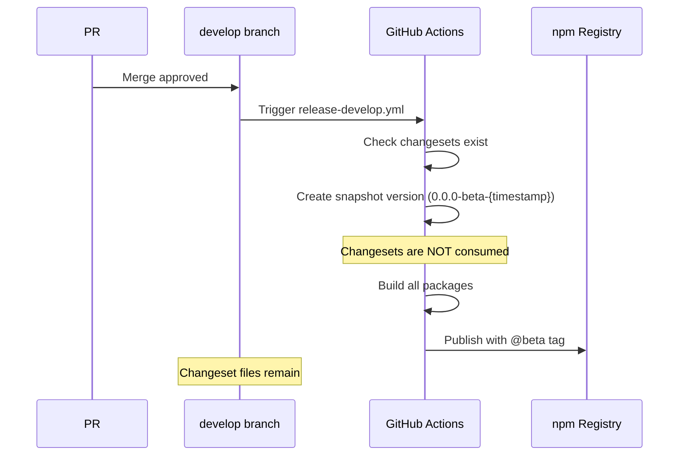
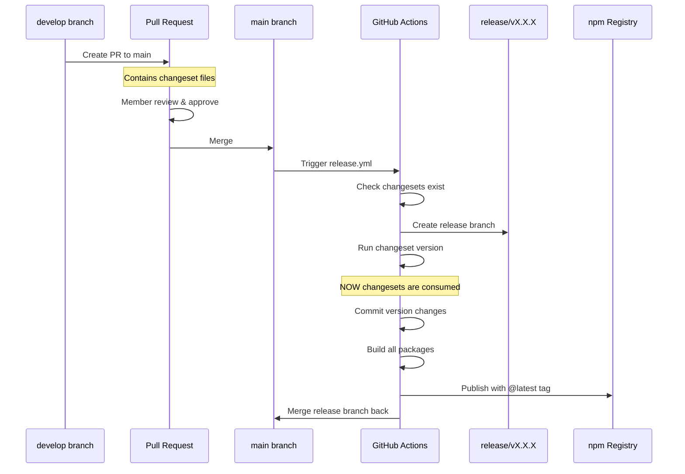

# Release Process Flow

## Overview

This document explains how the release process works with Changesets in our monorepo.

## 1. PR #191 승인 후 develop 브랜치 배포



**결과**:
- ✅ Changeset 파일들이 그대로 유지됨
- ✅ Beta 버전으로 npm에 배포됨 (예: 1.1.2-beta-20240619)
- ✅ 각 패키지가 독립적으로 배포됨

## 2. develop → main PR 생성 및 승인



**결과**:
- ✅ Changeset 파일들이 main에서 소비됨
- ✅ 정식 버전으로 배포됨 (예: 1.1.2)
- ✅ Beta에서 테스트된 내용이 그대로 반영됨

## 3. 독립적 패키지 배포 예시

```mermaid
graph TD
    subgraph "Changeset 파일들"
        A[brave-foxes-dance.md<br/>vue-pivottable: patch] 
        B[kind-lions-jump.md<br/>@vue-pivottable/plotly-renderer: minor]
    end
    
    subgraph "Beta 배포 (develop)"
        A --> C[vue-pivottable@1.1.2-beta-20240619]
        B --> D[@vue-pivottable/plotly-renderer@2.1.0-beta-20240619]
    end
    
    subgraph "Production 배포 (main)"
        A --> E[vue-pivottable@1.1.2]
        B --> F[@vue-pivottable/plotly-renderer@2.1.0]
    end
```

## Key Points

1. **Snapshot 버전 사용**: develop 브랜치에서는 `--snapshot` 옵션으로 changeset을 소비하지 않음
2. **Changeset 보존**: develop에서 main으로 PR 시 changeset 파일들이 포함됨
3. **독립적 배포**: 각 패키지는 자체 changeset에 따라 독립적으로 버전이 관리됨
4. **Beta 테스트**: develop에서 beta 태그로 먼저 배포하여 테스트 가능

## Commands

### 개발자가 사용하는 명령어
```bash
# 변경사항 추가
pnpm changeset add

# 어떤 패키지가 배포될지 확인
pnpm changeset status
```

### CI에서 사용되는 명령어
```bash
# develop (beta)
pnpm changeset version --snapshot beta
pnpm changeset publish --tag beta --no-git-tag

# main (production)
pnpm changeset version
pnpm changeset publish
```