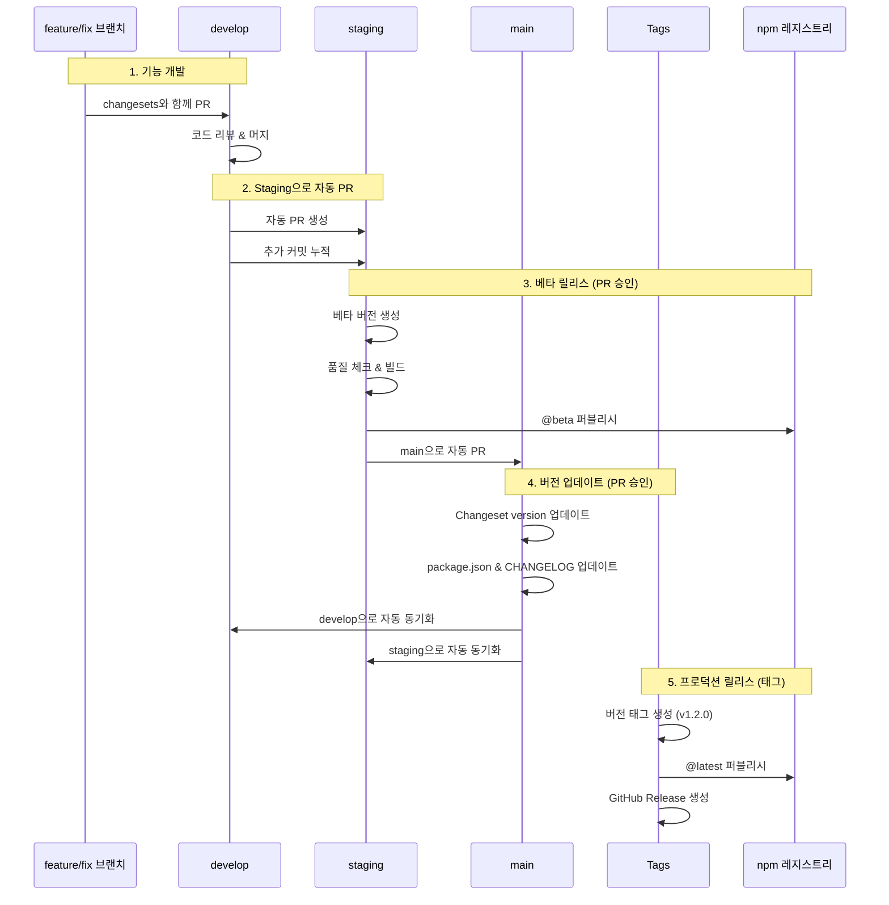
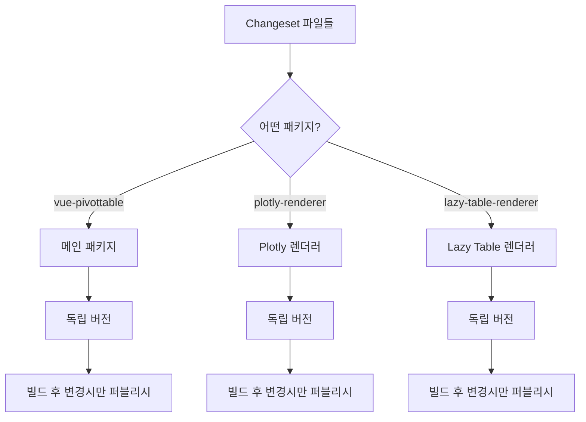

# 릴리스 전략

> [English](./RELEASE_STRATEGY.md) | 한국어

## 개요

이 문서는 자동화된 워크플로우, Changesets를 통한 버전 관리, 그리고 프로덕션 배포를 위한 태그 기반 릴리스를 사용하는 vue3-pivottable 모노레포의 릴리스 전략을 설명합니다.

## 릴리스 플로우



## 브랜치 책임

### develop 브랜치
- **목적**: 모든 기능의 통합 브랜치
- **자동 작업**:
  - push 시 staging으로 자동 PR 생성
  - 기존 staging PR에 변경사항 누적
  - 지속적 통합 체크

### staging 브랜치
- **목적**: QA 테스트 및 베타 릴리스
- **PR 머지 시 자동 작업**:
  - 누적된 changesets 확인
  - changesets가 있을 경우:
    - changesets 소비 (파일 삭제)
    - 베타 버전 생성 (x.y.z-beta.timestamp)
    - 품질 체크 실행 (ESLint, TypeScript)
    - 모든 패키지 빌드
    - @beta 태그로 npm에 퍼블리시
    - main으로 자동 PR 생성
  - changesets가 없으면: 릴리스 프로세스 건너뛰기

### main 브랜치
- **목적**: 프로덕션 준비 코드
- **보호**: 직접 커밋 불가 (PR만 가능)
- **PR 머지 시 자동 작업**:
  - `changeset version` 실행
  - package.json 버전 업데이트
  - CHANGELOG.md 생성/업데이트
  - 버전 변경사항 커밋
  - develop과 staging으로 변경사항 동기화
  - **npm 퍼블리시하지 않음**

### Tags (v*.*.*)
- **목적**: 프로덕션 릴리스 트리거
- **생성**: main 업데이트 후 수동
- **자동 작업**:
  - 태그된 커밋에서 체크아웃
  - 모든 패키지 빌드
  - @latest 태그로 npm에 퍼블리시
  - GitHub Release 생성

## 패키지 독립성

모노레포는 독립적으로 버전이 관리되는 세 개의 패키지를 포함합니다:



### 설정
```json
{
  "linked": [],      // 연결된 패키지 없음
  "fixed": [],       // 고정 버전 없음
  "access": "public"
}
```

이를 통해 각 패키지는:
- 자체 버전 번호를 가짐
- 독립적으로 릴리스 가능
- 변경사항이 있을 때만 퍼블리시

## 버전 예시

### 시나리오 1: 단일 패키지 업데이트
```yaml
# 메인 패키지의 버그 수정을 위한 Changeset
"vue-pivottable": patch

# staging에서의 결과:
vue-pivottable: 1.1.1 → 1.1.2-beta.1234567890
@vue-pivottable/plotly-renderer: 2.0.0 (변경 없음)
@vue-pivottable/lazy-table-renderer: 1.0.13 (변경 없음)

# main 머지 후 결과:
vue-pivottable: 1.1.2 (버전 업데이트됨, 퍼블리시 안 됨)

# v1.1.2 태그 생성 후:
vue-pivottable: 1.1.2 → npm @latest
```

### 시나리오 2: 다중 패키지 업데이트
```yaml
# 새 기능을 위한 Changesets
"vue-pivottable": minor
"@vue-pivottable/plotly-renderer": minor

# staging에서의 결과:
vue-pivottable: 1.1.1 → 1.2.0-beta.1234567890
@vue-pivottable/plotly-renderer: 2.0.0 → 2.1.0-beta.1234567890

# main 머지 후 결과:
vue-pivottable: 1.2.0 (업데이트됨)
@vue-pivottable/plotly-renderer: 2.1.0 (업데이트됨)

# v1.2.0 태그 생성 후:
두 패키지 모두 → npm @latest
```

## 품질 게이트

### PR 체크 (pr-check.yml)
1. ESLint - 모든 패키지
2. TypeScript 타입 체킹 - 모든 패키지
3. 빌드 검증 - 모든 패키지
4. Changeset 존재 확인

### 릴리스 체크
1. 빌드 전 타입 체킹
2. 빌드 전 린팅
3. 퍼블리시를 위해 빌드 성공 필수
4. 오류 허용 퍼블리싱 (한 패키지가 실패해도 다른 패키지 계속 진행)

## 워크플로우 파일

### 1. `.github/workflows/pr-check.yml`
- **트리거**: 모든 브랜치로의 PR
- **체크**: Lint, TypeCheck, Build, Changesets
- **목적**: 머지 전 코드 품질 보장

### 2. `.github/workflows/integrate-develop.yml`
- **트리거**: develop으로 푸시
- **작업**: staging으로 PR 생성/업데이트
- **핵심 기능**: 다중 변경사항 누적

### 3. `.github/workflows/release-staging.yml`
- **트리거**: staging으로 푸시
- **조건**: changesets가 존재할 때 (develop에서 누적됨)
- **작업**: 베타 버전, 빌드, @beta 퍼블리시
- **핵심 기능**: changesets 소비, main으로 자동 PR

### 4. `.github/workflows/update-version.yml`
- **트리거**: main으로 푸시 (베타 버전 포함)
- **작업**: 버전 업데이트, 브랜치 동기화
- **핵심 기능**: npm 퍼블리시 안 함

### 5. `.github/workflows/release-tag.yml`
- **트리거**: 태그 푸시 (v*.*.*)
- **작업**: 빌드, @latest 퍼블리시
- **핵심 기능**: 프로덕션 배포

## 보안

### npm 토큰
- `NPM_TOKEN`: 메인 패키지 퍼블리싱
- `NPM_TOKEN_SUMIN`: 스코프 패키지 퍼블리싱
- GitHub Secrets로 저장

### 브랜치 보호
- main: PR 필수, 직접 푸시 불가
- staging: PR 필수, 직접 푸시 불가
- develop: PR 필수, 직접 푸시 불가

## 명령어 참조

| 명령어 | 설명 |
|---------|-------------|
| `pnpm changeset` | 변경사항에 대한 changeset 추가 |
| `pnpm changeset status` | 대기 중인 changesets 확인 |
| `pnpm changeset version` | changesets를 버전에 적용 |
| `pnpm build:all` | 모든 패키지 빌드 |
| `pnpm typecheck` | TypeScript 체크 실행 |
| `pnpm lint` | ESLint 실행 |
| `pnpm -r <command>` | 모든 워크스페이스에서 명령 실행 |

## 모범 사례

1. **항상 changesets 추가** - 릴리스를 트리거해야 하는 변경사항에 대해
2. **베타에서 먼저 테스트** - staging이 베타 테스트 환경 제공
3. **자동 PR 검토** - 승인 전 자동화된 PR 확인
4. **main 업데이트 후 태그** - main에서 버전 업데이트 후에만 태그 생성

## 릴리스 프로세스 중 업데이트 처리

### 시나리오: 지속적인 개발 플로우

워크플로우는 진행 중인 개발을 원활하게 처리합니다:

1. **자동 PR 업데이트**
   - develop → staging PR이 새 커밋 누적
   - 각 추가사항마다 PR 설명 업데이트
   - 여러 기능/수정을 위한 단일 PR

2. **베타 버전 관리**
   - 각 staging 머지마다 새 베타 버전 생성
   - 이전 베타 버전도 사용 가능
   - 명확한 버전 진행 추적

3. **동기화**
   - main 업데이트가 develop/staging으로 되돌아감
   - 브랜치 간 차이 방지
   - 선형 히스토리 유지

### 예시 플로우
```
1. 기능 A를 develop에 머지 → staging으로 자동 PR #123
2. 기능 B를 develop에 머지 → PR #123 업데이트
3. PR #123 승인 → v1.2.0-beta.1234567890
4. main으로 자동 PR #124 생성
5. PR #124 승인 → main에 버전 1.2.0
6. v1.2.0 태그 생성 → npm에 퍼블리시
7. develop/staging이 main과 동기화
```

## 릴리스 체크리스트

### 개발자용
- [ ] develop에서 feature/fix 브랜치 생성
- [ ] 적절한 버전 bump와 함께 changeset 추가
- [ ] develop으로 PR 생성
- [ ] 모든 체크 통과 확인

### QA 팀용
- [ ] staging PR 내용 검토
- [ ] npm에서 베타 버전 테스트
- [ ] 준비되면 staging PR 승인

### 릴리스 관리자용
- [ ] staging에서 온 main PR 검토
- [ ] main PR 승인 (버전 업데이트 트리거)
- [ ] 동기화 완료 대기
- [ ] 버전 태그 생성 및 푸시:
  ```bash
  git checkout main
  git pull origin main
  git tag v1.2.0
  git push origin v1.2.0
  ```
- [ ] npm 배포 확인
- [ ] GitHub Release 생성 확인

## 문제 해결

### 자동 PR이 생성되지 않나요?
- GitHub Actions 실행 확인
- 브랜치 보호가 봇 PR을 허용하는지 확인
- 기존 열린 PR이 있는지 확인

### 베타 버전이 퍼블리시되지 않나요?
- changesets가 추가되었는지 확인
- staging에서 빌드 성공 확인
- npm 토큰 유효성 확인

### 동기화 실패?
- 머지 충돌 확인
- 워크플로우 로그 검토
- 수동 동기화 필요할 수 있음

### 태그 릴리스 실패?
- 태그가 버전 패턴과 일치하는지 확인 (v*.*.*)
- npm 토큰 권한 확인
- 패키지 빌드 성공 확인