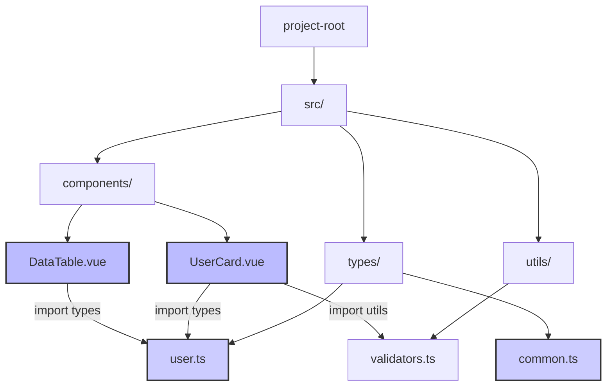
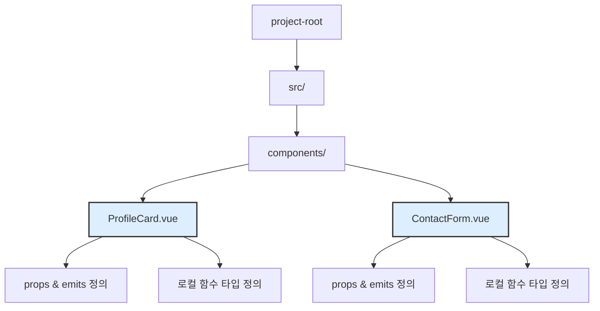
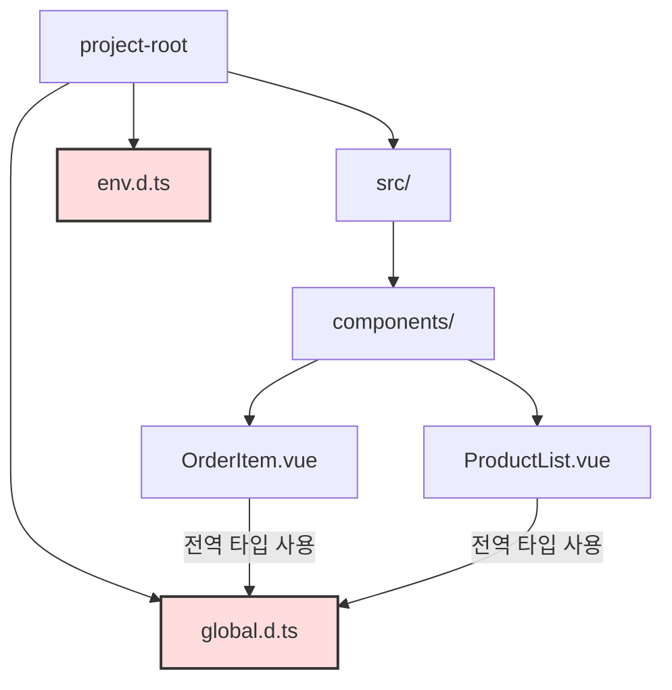
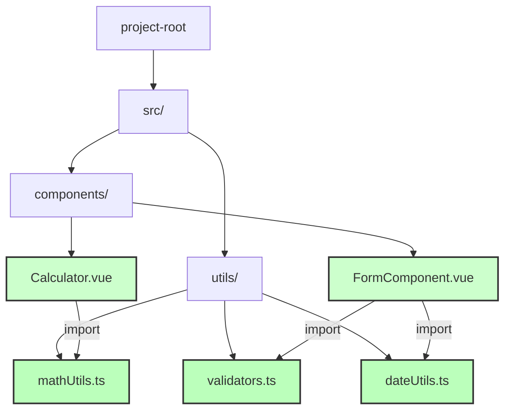
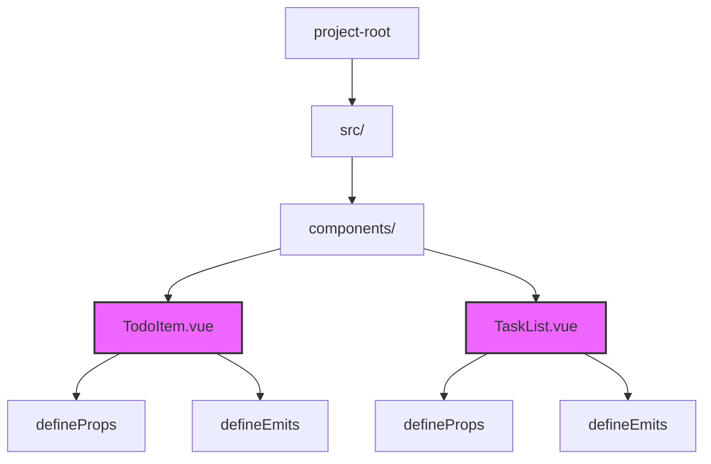
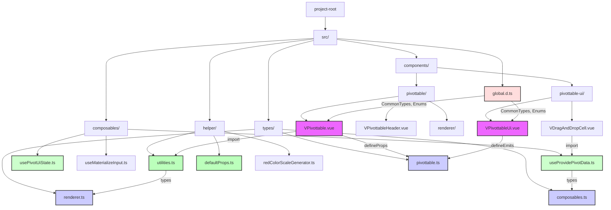

Vue 3 프로젝트에서 TypeScript를 활용할 때 선택할 수 있는 다양한 아키텍처 패턴을 시각화와 함께 정리한 가이드입니다. 각 패턴은 프로젝트 규모와 팀 구성에 따라 선택적으로 적용할 수 있습니다.

<!--more-->

---

## 아키텍처 패턴 개요

| 패턴              | 장점                  | 단점               | 적용 규모     |
| --------------- | ------------------- | ---------------- | --------- |
| 분리형 타입 관리       | 재사용성 우수, 유지보수 편리    | 디렉토리 복잡도 증가      | 중대형 프로젝트  |
| 인라인 타입 정의       | 빠른 개발, 컴포넌트 구조 명확   | 재사용 불가, 중복 증가    | 소형 프로젝트   |
| 전역 선언 타입        | 어디서든 타입 사용 가능       | 네이밍 충돌, 전역 오염 위험 | 공통 타입 정의  |
| 유틸/헬퍼 모듈화       | 테스트 용이, 책임 분리       | 의존성/폴더 구조 관리 필요  | 로직 집약 프로젝트 |
| 명시적 Props/Emits | IDE 지원 뛰어남, API 명확화 | 복잡한 타입은 외부 분리 필요 | 모든 규모     |

---

## 1. 분리형 타입 관리 아키텍처

타입을 별도 디렉토리에서 관리하며, 각 컴포넌트에서 필요시 import하여 사용하는 패턴입니다.

**특징**

- 타입 재사용성이 높음
- 유지보수와 협업에 유리
- 구조가 커져 복잡도 증가

---

## 2. 인라인 타입 정의 아키텍처

모든 타입을 각 컴포넌트 파일 내에서 직접 정의하고 관리하는 패턴입니다.

**특징**

- 빠른 개발 가능
- 파일 하나로 구조 이해 용이
- 재사용성 낮음, 중복 증가

---

## 3. 전역 선언 타입 아키텍처

`.d.ts` 파일에 전역 타입을 선언하여 어디서든 사용하는 패턴입니다. 두 가지 방식으로 구현할 수 있습니다.

**특징**

- 반복되는 타입 정의 최소화
- 어디서든 접근 가능
- 전역 오염 위험, 충돌 가능성

**구현 방식 구분**

- **진짜 전역 타입**: `declare global` 블록 사용, import 불필요
- **Ambient 모듈**: 일반 `.d.ts` 파일, import 필요

**파일 확장자 구분:**

- `.d.ts`: 타입 선언만 포함 (전역 타입, 라이브러리 타입)
- `.ts`: 타입 정의 + 실제 코드 (일반적인 타입 파일)

---

## 4. 유틸/헬퍼 모듈화 아키텍처

비즈니스 로직을 utils 디렉토리에 모듈화하고 타입도 함수별로 분리하여 작성하는 패턴입니다.

**특징**

- 코드 테스트 쉬움
- 함수 책임 분리 용이
- 디렉토리 및 의존성 관리 필요

---

## 5. 명시적 Props/Emits 아키텍처

Vue 3 `<script setup>` 구문과 함께 `defineProps`, `defineEmits`에 명시적인 타입을 지정하는 패턴입니다.

**특징**

- 타입 안정성 높고, IDE 지원 우수
- 컴포넌트 API 명확화
- 복잡한 경우 외부 분리 필요함

---

## 혼합 패턴: 하이브리드 아키텍처

실제 프로젝트에서는 여러 패턴을 조합하여 사용합니다. 다음은 Vue Pivottable 프로젝트 구조를 기반으로 한 혼합 아키텍처 예시입니다.

### 혼합 패턴 구성 요소

#### 1. 분리형 타입 관리 + 명시적 Props/Emits

- `/types` 디렉토리에서 타입 통합 관리
- 컴포넌트에서 `defineProps<T>`, `defineEmits<T>` 명시적 타입 지정

#### 2. 유틸/헬퍼 모듈화

- `/helper` 디렉토리에 비즈니스 로직 분리
- `/composables` 디렉토리에 Vue 3 Composition API 로직 분리

#### 3. 전역 선언 타입 (선택적)

- 프로젝트 전역에서 사용하는 Enum, 공통 인터페이스 정의

---

## 파일 확장자 가이드

### `.ts` (TypeScript Files)

- **용도**: 타입 정의 + 실제 구현 코드
- **위치**: `/types`, `/utils`, `/composables` 등
- **예시**: `user.ts`, `api.ts`, `validators.ts`

### `.d.ts` (Declaration Files)  

- **용도**: 타입 선언만 포함 (런타임 코드 없음)
- **위치**: 프로젝트 루트, 전역 선언
- **예시**: `global.d.ts`, `env.d.ts`, `vite-env.d.ts`
